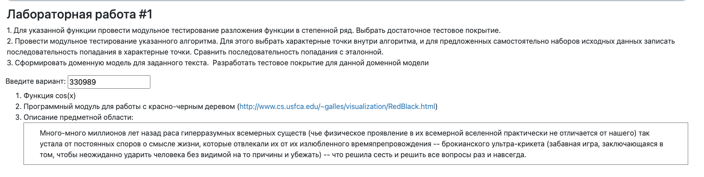

## ТПО: Лабораторная работа #1
Рекалов Артём Олегович, P3309
Вариант 330989
---
1. Для указанной функции провести модульное тестирование разложения функции в степенной ряд. Выбрать достаточное тестовое покрытие.
2. Провести модульное тестирование указанного алгоритма. Для этого выбрать характерные точки внутри алгоритма, и для предложенных самостоятельно наборов исходных данных записать последовательность попадания в характерные точки. Сравнить последовательность попадания с эталонной.
3. Сформировать доменную модель для заданного текста.  Разработать тестовое покрытие для данной доменной модели

1. Функция cos(x)
2. Программный модуль для работы с красно-черным деревом (http://www.cs.usfca.edu/~galles/visualization/RedBlack.html)
Описание предметной области:
   Много-много миллионов лет назад раса гиперразумных всемерных существ (чье физическое проявление в их всемерной вселенной практически не отличается от нашего) так устала от постоянных споров о смысле жизни, которые отвлекали их от их излюбленного времяпрепровождения -- брокианского ультра-крикета (забавная игра, заключающаяся в том, чтобы неожиданно ударить человека без видимой на то причины и убежать) -- что решила сесть и решить все вопросы раз и навсегда.

