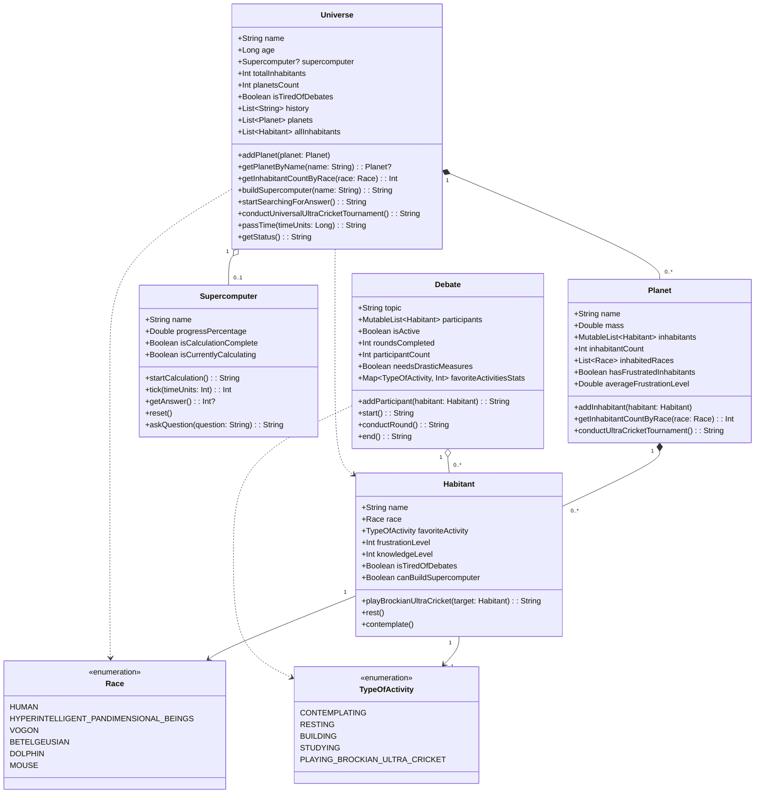

# UML Диаграмма классов доменной модели "Вселенная"

## Описание связей

### Композиция (◆—)
- **Universe → Planet**: Вселенная содержит планеты. При удалении вселенной удаляются и все планеты.
- **Planet → Habitant**: Планета населена обитателями. При удалении планеты удаляются все её обитатели.

### Агрегация (◇—)
- **Universe → Supercomputer**: Вселенная может иметь суперкомпьютер, но суперкомпьютер может существовать независимо.
- **Debate → Habitant**: Дискуссия включает участников, но обитатели существуют независимо от дискуссий.

### Ассоциация (—)
- **Habitant → Race**: Каждый обитатель принадлежит к определённой расе.
- **Habitant → TypeOfActivity**: Каждый обитатель имеет любимый вид деятельности.

### Зависимость (- - >)
- **Universe ..> Habitant**: Universe использует методы Habitant для проверки возможностей.
- **Universe ..> Race**: Universe подсчитывает обитателей по расам.
- **Debate ..> TypeOfActivity**: Debate анализирует статистику любимых занятий.
